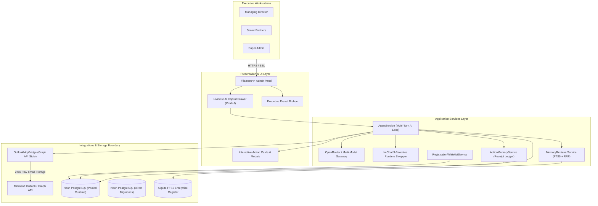

<h1 align="center">DPIK TADBIR</h1>

<p align="center">
  <strong>by DPI Konsult & ARH — Executive Management Command Center, Email Intelligence Copilot & Enterprise Knowledge Workstation</strong>
</p>

<p align="center">
  <a href="LICENSE"></a>
  
  
  
  
  
</p>

---

## What DPIK Tadbir is for

DPIK Tadbir exists to answer the critical questions company leadership needs answered instantly without wading through hundreds of inbox threads:

> _"What were the exact commitments we made to JKR regarding the Bintulu Port geotechnical scope in last week's email exchanges, what actions are awaiting my sign-off today, and what is the current multi-project health status across all active tenders?"_

Senior leadership relies on Microsoft Outlook for day-to-day communication, but Outlook lacks structured memory to connect email commitments to long-term project registers, personal tasks, and corporate decisions. Storing duplicate raw email blobs creates database bloat and compliance liability. DPIK Tadbir acts as an **intelligent AI processing and synthesis layer** over Outlook: it queries Microsoft Graph on-demand via `outlook-mcp`, extracts high-signal summaries and action items, and commits them to a permanent, searchable memory register—storing zero raw email text or attachment blobs.

**Who it's for**: The Managing Director, partners, and designated senior executives at DPI Konsult Sdn Bhd.

**What it solves today**: Zero raw email storage AI processing, one-click executive inquiry presets (_"What's new today?"_, _"Check my email today"_), an ARH Session Reader-inspired SQLite FTS5 hybrid BM25 + RRF memory engine, OpenRouter Unified Multi-Model Gateway with in-chat 3-favorites runtime swapper (`Cmd+J`), human-in-the-loop interactive Action Cards with cryptographic approval tokens for write safety, sovereign user-isolated executive workspaces (personal notes, tasks, chat history), and strict email-whitelisted registration gating.

**What's still ahead**: Full Gate 5 production deployment cutover on Cloud Run and cross-app federation with DPIK Tugas.

---

## Quick links

| Resource              | Target / Location                                                                                                        |
| --------------------- | ------------------------------------------------------------------------------------------------------------------------ |
| **Production UI**     | [dpik-tadbir-102469945521.asia-southeast1.run.app/admin](https://dpik-tadbir-102469945521.asia-southeast1.run.app/admin) |
| **Repository**        | [github.com/arhsmoque2/dpik-tadbir](https://github.com/arhsmoque2/dpik-tadbir)                                           |
| **CI / Deploy Runs**  | [GitHub Actions Pipeline](https://github.com/arhsmoque2/dpik-tadbir/actions)                                             |
| **Cloud Run Service** | `dpik-tadbir` in `asia-southeast1` (GCP Project: `arh-gcloud-vm`)                                                        |
| **Database (Neon)**   | Serverless PostgreSQL 16 (`floral-haze-01285681`, `aws-ap-southeast-1`)                                                  |
| **MCP Integration**   | Native Laravel MCP (`/mcp`) + Python `outlook-mcp` (Microsoft Graph API)                                                 |
| **AI Gateway**        | OpenRouter Unified Gateway + Claude 3.7 Sonnet & Gemini 2.5 Flash Fallbacks                                              |

---

## Architecture & Operating Principles



### Core Invariants

1. **Zero Raw Email Storage Boundary**: The system queries Outlook on-demand via `outlook-mcp` (Microsoft Graph API) and stores only processed intelligence (summaries, action items, personal notes, and project register records). No raw email bodies or attachment blobs are stored in the database.
2. **Explicit Human-in-the-Loop Write Confirmation**: The AI generates interactive Action Cards for drafting, replying, and forwarding; outbound execution requires explicit human confirmation with signed one-time tokens before dispatch.
3. **Whitelisted Registration & Sovereign Isolation**: Public signup is disabled. Access is gated by `allowed_registration_emails` ([ADR-013](docs/adr/ADR-013-whitelisted-registration-and-sovereign-executive-isolation.md)). Each executive gets private notes, tasks, chat histories, and mailbox credentials with zero data leakage.
4. **Hybrid BM25 + RRF Project Memory**: Project insights are indexed in SQLite FTS5 using Reciprocal Rank Fusion and decision markers (`dm:decision`, `dm:commitment`), formatted into high-density pipe-delimited context (<500 tokens).
5. **Multi-Model Dynamic Swapping**: Executives can switch between favorite AI models in-chat (`Cmd+J`) across Anthropic, Google Gemini, and OpenRouter, with user-scoped encrypted API keys stored at rest.

---

## Tech stack

| Layer                       | Technology                    | Specification                                                 |
| --------------------------- | ----------------------------- | ------------------------------------------------------------- |
| **Backend Framework**       | Laravel 12                    | PHP 8.4+, strict type checking, Level 8 Larastan              |
| **Admin & Control Plane**   | Filament v4 + Livewire 3      | Tailwind CSS, Alpine.js, FilaCheck AST verified               |
| **AI Gateway & Copilot**    | OpenRouter + Native SDKs      | Claude 3.7 Sonnet, Gemini 2.5 Flash, 3-Favorites Swapper      |
| **MCP Subsystem**           | `laravel/mcp` + `outlook-mcp` | Stdio Microsoft Graph bridge with write-safety tokens         |
| **Memory Engine**           | SQLite FTS5 + RRF             | BM25 lexical search, reciprocal rank fusion, decision markers |
| **Production Hosting**      | Google Cloud Run              | `asia-southeast1`, keyless OIDC GitHub Actions deploy         |
| **Database (Production)**   | Neon PostgreSQL 16            | Serverless auto-scaling with isolated pooler topology         |
| **Database (Test / Local)** | SQLite                        | `:memory:` for hermetic tests, file for local sandbox         |
| **Quality & Linters**       | Comprehensive Suite           | PHPStan Level 8, Pint, Pest 3, Playwright, Axe-core AA        |

**Scale & Coverage**: 107 files verified at PHPStan Level 8, 83 hermetic Pest tests (487 assertions), 18 Architecture Decision Records (ADRs), 17/17 FilaCheck AST rules passed, and sub-second cold-start execution.

---

## Features & Capability Status

| Capability / Module                 | Status     | Verification & Evidence                                                                                       | Governing Specification                                                                     |
| ----------------------------------- | ---------- | ------------------------------------------------------------------------------------------------------------- | ------------------------------------------------------------------------------------------- |
| **Zero Raw Email Ingestion**        | Verified   | Outlook MCP integration extracts summaries/notes on-demand; zero raw email tables in schema.                  | [ADR-003](docs/adr/ADR-003-outlook-mcp-email-processor-boundary.md)                         |
| **OpenRouter Multi-Model Gateway**  | Verified   | Unified gateway supporting Claude 3.7 Sonnet, Gemini 2.5 Flash, and OpenRouter with automatic failover.       | [ADR-018](docs/adr/ADR-018-openrouter-multi-model-catalog-and-runtime-favorites-swapper.md) |
| **In-Chat 3-Favorites Swapper**     | Verified   | Zero-reload keyboard shortcut (`Cmd+J`) modal to swap active models during live chat turns.                   | [ADR-018](docs/adr/ADR-018-openrouter-multi-model-catalog-and-runtime-favorites-swapper.md) |
| **Whitelisted Registration Gate**   | Verified   | Email whitelist middleware blocks unauthorized public signups; sovereign executive workspaces.                | [ADR-013](docs/adr/ADR-013-whitelisted-registration-and-sovereign-executive-isolation.md)   |
| **Executive Presets Ribbon**        | Verified   | One-click prompt ribbon (_"What's new today?"_, _"Check my email today"_) with dynamic lookback windows.      | [ADR-004](docs/adr/ADR-004-executive-presets-and-quick-action-engine.md)                    |
| **FTS5 & RRF Memory Engine**        | Verified   | ARH Session Reader pattern with BM25 + RRF ranking over project registers and action receipts.                | [ADR-006](docs/adr/ADR-006-hybrid-memory-search-and-retrieval-engine.md)                    |
| **Human-in-the-Loop Write Gates**   | Verified   | Interactive Action Cards with cryptographic tokens; human approval mandatory before email dispatch.           | [ADR-007](docs/adr/ADR-007-write-safety-human-in-the-loop-approval-gates.md)                |
| **Action Receipts & Audit Ledger**  | Verified   | Immutable action receipts tracking all AI operations, powering daily and weekly activity rollups.             | [ADR-008](docs/adr/ADR-008-action-receipts-and-automated-activity-rollups.md)               |
| **User-Configurable API Keys**      | Verified   | ExecutiveSettings allows personal Anthropic, Gemini, and OpenRouter key configuration with encrypted storage. | [ADR-002](docs/adr/ADR-002-ai-model-and-provider-governance.md)                             |
| **E2E & Accessibility Suite**       | Verified   | Playwright browser journeys, WCAG 2.1 Level AA conformance via `@axe-core/playwright`, and visual snapshots.  | [ADR-015](docs/adr/ADR-015-quality-gates-e2e-testing-and-ai-observability-resilience.md)    |
| **Cloud Run & Neon Infrastructure** | Configured | Multi-stage FrankenPHP containerization, Neon project `floral-haze-01285681`, and WIF bindings active.        | [ADR-016](docs/adr/ADR-016-ci-cd-quality-hardening-operational-blindspot-remediation.md)    |

---

## Operator & Developer Entry Points

| Purpose                    | Entry Point / Command                                            | Notes                                                  |
| -------------------------- | ---------------------------------------------------------------- | ------------------------------------------------------ |
| **Production UI Endpoint** | `https://dpik-tadbir-102469945521.asia-southeast1.run.app/admin` | Cloud Run Live Web URL                                 |
| **Local Web Server**       | `php artisan serve`                                              | Runs on `http://localhost:8000`                        |
| **Fast Quality Gate**      | `composer check:quick`                                           | Pint, FilaCheck, PHPStan Level 8, Pest parallel (<12s) |
| **Full Quality Gate**      | `composer check:full`                                            | Quick check + 90% diff-cover + composer-unused         |
| **PHP Static Analysis**    | `composer analyse`                                               | PHPStan / Larastan at Level 8 across 107 files         |
| **Filament AST Gate**      | `vendor/bin/filacheck app/Filament`                              | 17 Filament v4 AST rules validation                    |
| **Test Coverage Gate**     | `composer test:coverage`                                         | Full Pest coverage report (`coverage.xml`)             |
| **Diff Coverage Audit**    | `composer test:diff`                                             | Strict 90% diff-cover threshold on PR branches         |
| **MCP Server Endpoint**    | `php artisan mcp:serve`                                          | Native Laravel MCP endpoint for external agents        |
| **Outlook MCP Bridge**     | `python -m outlook_mcp.server`                                   | Local Python Microsoft Graph bridge                    |

---

## Local development

```bash
# 1. Clone repository and install dependencies
git clone https://github.com/arhsmoque2/dpik-tadbir.git
cd dpik-tadbir
composer install --no-interaction
pnpm install

# 2. Configure environment
cp .env.example .env
php artisan key:generate

# 3. Setup SQLite local database
touch database/database.sqlite
# Set DB_CONNECTION=sqlite and DB_DATABASE=<absolute-path-to-database.sqlite> in .env
php artisan migrate:fresh --seed --force

# 4. Build assets and launch dev server
pnpm build
php artisan serve
```

> [!NOTE]
> For environment contracts and cloud secrets mapping, see [`docs/ENVIRONMENT.md`](docs/ENVIRONMENT.md). For detailed setup guides, see [`DEVTOOLS.md`](DEVTOOLS.md) and [`docs/LOCAL-CONTEXT.md`](docs/LOCAL-CONTEXT.md).

---

## Configuration

Copy `.env.example` to `.env`. Key environment variables:

| Variable                      | Purpose                                          | Default / Requirement                       |
| ----------------------------- | ------------------------------------------------ | ------------------------------------------- |
| `APP_ENV`                     | Application environment state                    | `local`, `testing`, or `production`         |
| `APP_KEY`                     | Laravel AES-256-CBC encryption cipher key        | Generate via `php artisan key:generate`     |
| `ALLOWED_REGISTRATION_EMAILS` | Comma-separated whitelist of allowed user emails | Pre-approved corporate emails               |
| `DB_CONNECTION`               | Primary database driver                          | `sqlite` (local/test), `pgsql` (production) |
| `DATABASE_URL`                | Neon pooled connection string                    | Required in production (PgBouncer endpoint) |
| `DIRECT_DATABASE_URL`         | Neon direct connection string                    | Required for Cloud Run migration jobs       |
| `ANTHROPIC_API_KEY`           | Primary LLM key for Claude 3.7 Sonnet            | System fallback (overridable per user)      |
| `GEMINI_API_KEY`              | Secondary LLM key for Gemini 2.5 Flash           | System fallback (overridable per user)      |
| `OPENROUTER_API_KEY`          | Multi-model gateway key for OpenRouter           | System fallback (overridable per user)      |
| `MICROSOFT_CLIENT_ID`         | Microsoft Entra ID App Client ID                 | Required for Outlook MCP Graph access       |
| `MICROSOFT_CLIENT_SECRET`     | Microsoft Entra ID Client Secret                 | Required for Outlook MCP Graph access       |
| `OUTLOOK_MCP_COMMAND`         | Executable used to spawn Outlook MCP             | `uv`                                        |

---

## Folder structure

```
dpik-tadbir/
├── app/
│   ├── Enums/                    # System enums (ActionType, Priority, ModelProvider)
│   ├── Filament/Resources/       # Filament v4 Resources (ProjectRegister, Notes, Tasks, Presets)
│   ├── Http/Middleware/          # RegistrationWhitelistMiddleware
│   ├── Models/                   # Eloquent models (ProjectRegistryEntry, AiActionReceipt, Notes)
│   ├── Policies/                 # Strict per-user isolation policies
│   └── Services/                 # AgentService, OutlookMcpBridge, MemoryRetrievalService
├── bootstrap/                    # Framework bootstrap
├── config/                       # Application configuration
├── database/
│   ├── factories/                # Model factories for testing
│   ├── migrations/               # Database schema migrations
│   └── seeders/                  # System seeders (whitelisted users, presets)
├── docs/                         # Authoritative documentation suite
│   ├── adr/                      # 18 Architecture Decision Records (ADR-001 to ADR-018)
│   ├── ARCHITECTURE.md           # Technical architecture specification
│   ├── CAPABILITIES.md           # Domain capabilities specification ([CAP-...])
│   ├── CONFIGURABLES.md          # Runtime configuration matrix
│   ├── DESIGN.md                 # UI components and design tokens
│   ├── ENVIRONMENT.md            # Environment and infrastructure variable contract
│   ├── INTENT.md                 # Problem space, user outcomes, and boundaries
│   ├── LOCAL-CONTEXT.md          # Local development and operational context
│   └── QUALITY-GATES.md          # 4-tier verification hierarchy
├── public/                       # Web root and compiled assets
├── resources/
│   ├── css/                      # Tailwind styles and design tokens
│   ├── js/                       # Alpine.js copilot drawer components
│   └── views/                    # Blade views and copilot drawer templates
├── routes/                       # web.php, console.php, api.php
├── tests/
│   ├── Browser/                  # Playwright E2E tests, WCAG AA audits, visual regression
│   ├── Feature/                  # 83 hermetic Pest feature tests (Auth, MCP, AI, Memory)
│   └── Unit/                     # Unit test suites
├── AGENTS.md                     # Agent runtime operational guide
├── CURRENT_STATE.md              # Live verified operational state snapshot
├── DEVTOOLS.md                   # Pinned toolchains and runner runbooks
├── handoff.md                    # Session handoff notes and next actions
└── README.md                     # This file
```

---

## AI Copilot & MCP Tooling

DPIK Tadbir exposes and orchestrates tools across both internal services and external agents:

| Tool                       | Category | Authority         | Description                                                      |
| -------------------------- | -------- | ----------------- | ---------------------------------------------------------------- |
| `outlook_list_inbox_delta` | Read     | Safe              | Scans recent Outlook emails for new messages and threads.        |
| `outlook_search_mail`      | Read     | Safe              | Searches Outlook messages using query strings and date bounds.   |
| `outlook_read_message`     | Read     | Safe              | Retrieves concise message body and metadata (`concise=True`).    |
| `query_project_register`   | Read     | Safe              | Executes BM25 + RRF memory search over project registry entries. |
| `outlook_create_draft`     | Write    | Approval Required | Proposes an email draft; requires explicit user confirmation.    |
| `outlook_reply`            | Write    | Approval Required | Proposes an email reply; requires explicit user confirmation.    |
| `outlook_forward`          | Write    | Approval Required | Proposes an email forward; requires explicit user confirmation.  |
| `create_personal_note`     | Write    | Approval Required | Saves an extracted insight to the executive's private notes.     |
| `create_personal_task`     | Write    | Approval Required | Schedules an action item in the executive's private task list.   |
| `commit_project_register`  | Write    | Approval Required | Commits a new insight or decision to shared project memory.      |

---

## Quality Gates & Verification

DPIK Tadbir enforces a rigorous 4-tier verification hierarchy:

```
DPIK Tadbir Quality Gate Conformance Results:
- Gate 1: Code Style (Laravel Pint)             [PASS] (0 violations)
- Gate 1: AST Conformance (FilaCheck v4)        [PASS] (17/17 rules passed)
- Gate 1: Static Analysis (Larastan Level 8)    [PASS] (107/107 files clean)
- Gate 1: Markdown & Spelling (markdownlint)    [PASS] (38/38 files clean)
- Gate 2: Security & PII Sanitization           [PASS] (Gitleaks, Policy & Key Encryption)
- Gate 3: Hermetic Test Suite (Pest 3)          [PASS] (83 tests, 487 assertions)
- Gate 3: Diff Coverage Gate (diff-cover)       [PASS] (>=90% diff coverage)
- Gate 4: E2E Browser & Auth Journeys           [PASS] (Playwright browser suite)
- Gate 4: Accessibility (WCAG 2.1 AA)           [PASS] (@axe-core/playwright)
- Gate 4: Visual Regression (Max Diff 0.05)     [PASS] (Viewport snapshot comparisons)

Total: All gates passing cleanly.
```

---

## Documentation Suite

| Document                                         | Purpose & Separation of Concerns (SoC)                                           |
| ------------------------------------------------ | -------------------------------------------------------------------------------- |
| [`docs/INTENT.md`](docs/INTENT.md)               | Problem space, user outcomes, actors, principles, and boundaries                 |
| [`docs/CAPABILITIES.md`](docs/CAPABILITIES.md)   | Domain and product capabilities derived from operational scenarios (`[CAP-...]`) |
| [`docs/SCENARIOS.md`](docs/SCENARIOS.md)         | Grounded actor event flows, triggers, preconditions, and failure paths           |
| [`docs/DESIGN.md`](docs/DESIGN.md)               | UI components, design tokens, color map, typography, and contracts               |
| [`docs/ARCHITECTURE.md`](docs/ARCHITECTURE.md)   | Deep technical specification: process model, schemas, security, and invariants   |
| [`docs/ENVIRONMENT.md`](docs/ENVIRONMENT.md)     | Authoritative environment variable and cloud secrets contract                    |
| [`docs/CONFIGURABLES.md`](docs/CONFIGURABLES.md) | Runtime configuration matrix and zero-hardcoding settings store                  |
| [`docs/LOCAL-CONTEXT.md`](docs/LOCAL-CONTEXT.md) | Local development setup, toolchain requirements, and operational context         |
| [`docs/QUALITY-GATES.md`](docs/QUALITY-GATES.md) | 4-tier verification hierarchy and quality gate definitions                       |
| [`docs/OPPORTUNITIES.md`](docs/OPPORTUNITIES.md) | Future architectural opportunities and domain vocabulary guardrails              |
| [`CURRENT_STATE.md`](CURRENT_STATE.md)           | Live verified operational state snapshot and verification receipts               |
| [`DEVTOOLS.md`](DEVTOOLS.md)                     | Pinned toolchains, local setup, dev server commands, and check runners           |
| [`AGENTS.md`](AGENTS.md)                         | Agent runtime operational guide, prime directives, and boundaries                |
| [`handoff.md`](handoff.md)                       | Session handoff notes and cold-start single next action                          |
| [`docs/adr/`](docs/adr/)                         | 18 Architecture Decision Records (ADR-001 to ADR-018, all Accepted)              |

---

## License & Provenance

DPIK Tadbir is proprietary software developed for the internal operations of **DPI Konsult Sdn Bhd**. All rights reserved.

---

<p align="center">
  Built for DPI Konsult Sdn Bhd. Maintained by ARH.
</p>
