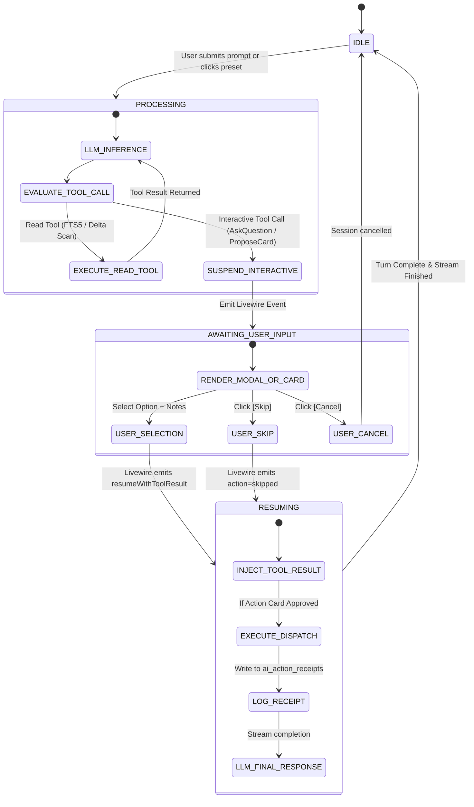

# DPIK Tadbir: System Design Specification

## [DESIGN-01] Component Breakdown & Subsystem Architecture
DPIK Tadbir is structured as a full-stack Laravel 12 application with a Filament v4 control plane. The system is partitioned into 6 decoupled subsystems:

```text
┌────────────────────────────────────────────────────────────────────────────┐
│                             DPIK TADBIR WORKSTATION                        │
├────────────────────────────────────────────────────────────────────────────┤
│                                                                            │
│  [1. Executive Control Plane & Filament UI]                                │
│  • App\Filament\Pages\ExecutiveAssistant (Livewire Chat Drawer & Presets)  │
│  • App\Filament\Resources\ProjectRegisterResource (Continuous Domain Mem)  │
│  • App\Filament\Resources\ActivityRollupResource (Daily/Weekly Audit Logs) │
│  • App\Filament\Pages\ExecutiveSettings (Namespaced Settings Control)     │
│                                                                            │
│  [2. AI Agent Core & State Machine]                                        │
│  • App\Services\Ai\AgentService (Multi-Turn Conversational Reasoning Loop) │
│  • App\Services\Ai\LlmGatewayService (Multi-Provider Anthropic/Gemini/OAI) │
│  • App\Services\Ai\AntiHallucinationGuard (Action Verification Validator)  │
│  • App\Services\Ai\PersonalizationReflectionService (Weekly Profiler)      │
│                                                                            │
│  [3. MCP Bridge & Interactive Tool Registry]                               │
│  • App\Mcp\ToolRegistry (laravel/mcp Adapter & Permission Scoper)          │
│  • App\Mcp\Tools\Outlook\* (Search, DeltaScan, ReadMessage, Draft, Send)   │
│  • App\Mcp\Tools\Interactive\* (AskUserQuestion, ProposeActionCard)        │
│  • App\Mcp\Tools\Memory\* (QueryProjectRegister, CommitProjectRegister)    │
│  • App\Services\Mcp\OutlookMcpBridge (Stdio/IPC connector to Python server)│
│                                                                            │
│  [4. Project Register & Hybrid Retrieval Subsystem (ARH Session Reader)]   │
│  • App\Services\Memory\MemoryRetrievalService (FTS5 BM25 + RRF Reranker)   │
│  • App\Services\Memory\DecisionMarkerExtractor (dm:decision/commitment)    │
│  • App\Services\Memory\DenseContextFormatter (Token-Dense Pipe Context)    │
│  • App\Models\ProjectRegistryEntry & Database Triggers for FTS5 Virtual Tbl│
│                                                                            │
│  [5. Action Memory & Executive Rollups Engine]                             │
│  • App\Services\Audit\ActionMemoryService (Receipt Logger & Audit Trail)   │
│  • App\Jobs\GenerateDailyRollupJob & GenerateWeeklyRollupJob               │
│  • App\Models\AiActionReceipt & AuditLog                                   │
│                                                                            │
│  [6. Runtime Settings & Preset Engine]                                     │
│  • App\Settings\* (AiSettings, OutlookSettings, SafetySettings, etc.)      │
│  • App\Services\Presets\PresetExecutionService (Dynamic Prompt Interpolate)│
│  • App\Models\ExecutivePreset                                              │
│                                                                            │
└────────────────────────────────────────────────────────────────────────────┘
```

---

## [DESIGN-02] State Authority & Data Ownership

| Data Domain | Canonical State Authority | Local Storage Model | Cache & Invalidation Policy |
| :--- | :--- | :--- | :--- |
| **Raw Outlook Emails** | **Microsoft Exchange / Graph API** | **Zero raw storage** (ephemeral context only) | Transient prompt window; discarded after turn |
| **Project Knowledge** | `project_registry_entries` table | Relational + SQLite FTS5 Virtual Table | Synchronized via DB triggers on save |
| **User Personalization** | `user_personalization_profiles` | JSON column / Model | In-memory cache; flushed on weekly reflection / save |
| **Action Receipts** | `ai_action_receipts` | Immutable Append-Only Ledger | Indexed by `user_id` and `executed_at` |
| **Runtime Settings** | `system_settings` (Spatie) | Database-backed Key-Value Store | In-memory cache; hot-reloaded on Filament save |
| **Executive Presets** | `executive_presets` table | Relational Eloquent Model | Cached in Redis/Array cache (TTL: 24h) |
| **Personal Notes/Tasks**| `personal_notes`, `personal_tasks` | User-scoped Relational Tables | Scoped strictly via Tenant/User policies |

---

## [DESIGN-03] Concrete Class Contracts & Method Signatures

### 1. AI Agent Loop & Provider Gateway
```php
namespace App\Services\Ai;

use App\Models\ChatSession;
use App\Models\ChatMessage;
use App\DTOs\AiTurnResponse;

class AgentService
{
    public function __construct(
        protected LlmGatewayService $llmGateway,
        protected ToolRegistry $toolRegistry,
        protected AntiHallucinationGuard $guard,
        protected MemoryRetrievalService $memory
    ) {}

    public function handleUserTurn(ChatSession $session, string $prompt): AiTurnResponse;
    public function resumeWithToolResult(ChatSession $session, string $toolUseId, array $result): AiTurnResponse;
}

class LlmGatewayService
{
    public function complete(array $messages, array $tools = [], array $options = []): array;
    public function getActiveProvider(): string;
    public function getActiveModel(): string;
}
```

### 2. Outlook MCP Bridge Client
```php
namespace App\Services\Mcp;

class OutlookMcpBridge
{
    public function callTool(string $toolName, array $arguments = []): array;
    public function checkAuthStatus(): bool;
    public function fetchInboxDelta(int $lookbackHours = 24, int $limit = 25, bool $concise = true): array;
    public function searchMail(string $query, int $limit = 25, bool $concise = true): array;
    public function sendReply(string $messageId, string $body, array $attachments = []): bool;
    public function forwardMessage(string $messageId, array $toRecipients, string $comment): bool;
}
```

### 3. Hybrid Memory Retrieval & FTS5 Subsystem (ARH Session Reader Pattern)
```php
namespace App\Services\Memory;

use Illuminate\Support\Collection;
use App\DTOs\MemorySearchResult;

class MemoryRetrievalService
{
    /**
     * Executes dual-path lexical FTS5 BM25 + Recency RRF Search.
     */
    public function search(
        string $query,
        ?string $projectCode = null,
        ?string $since = '30d',
        ?string $decisionMarker = null,
        int $limit = 10
    ): Collection;

    public function formatAsDenseContext(Collection $results): string;
}

class DenseContextFormatter
{
    /**
     * Emits token-dense format: "YYYY-MM-DD | project:CODE | dm:TYPE | snippet"
     */
    public function format(Collection $records): string;
}
```

### 4. Interactive Human-in-the-Loop Tools
```php
namespace App\Mcp\Tools\Interactive;

use Laravel\Mcp\Server\Tool;

class AskUserQuestionTool extends Tool
{
    protected string $name = 'ask_user_question';
    protected string $description = 'Presents a multiple-choice question modal to the executive with non-exclusive freeform notes and escape hatches (Skip/Cancel).';

    public function schema(): array
    {
        return [
            'type' => 'object',
            'required' => ['question', 'options'],
            'properties' => [
                'question' => ['type' => 'string'],
                'options' => ['type' => 'array', 'items' => ['type' => 'string']],
                'is_multi_select' => ['type' => 'boolean', 'default' => false],
                'allow_custom_input' => ['type' => 'boolean', 'default' => true],
                'custom_input_placeholder' => ['type' => 'string']
            ]
        ];
    }

    public function handle(array $arguments): array
    {
        // Suspends execution loop; dispatches Livewire interactive modal event
        return ['status' => 'suspended', 'state' => 'AWAITING_USER_INPUT', 'payload' => $arguments];
    }
}
```

---

## [DESIGN-04] Asynchronous Interactive State Machine



---

## [DESIGN-05] Error Handling, Degradation & Safety Guardrails

1. **LLM Primary Failure & Failover Cascade**:
   - If the primary provider (e.g. Anthropic) returns `429 Too Many Requests` or `503 Service Unavailable`, `LlmGatewayService` automatically retries against the configured fallback provider (e.g. Google Gemini) with exponential backoff ($250\text{ms} \rightarrow 1\text{s} \rightarrow 2\text{s}$).
2. **Outlook MCP Disconnection Graceful Recovery**:
   - If the Python bridge fails or Graph token expires (401), the UI renders an inline danger badge with an actionable **[Re-authenticate Outlook]** button rather than crashing the Filament view.
3. **Anti-Hallucination Guard (`AntiHallucinationGuard`)**:
   - Any response where the assistant claims to have sent an email, created a note, or reassigned a ticket without an associated `AiActionReceipt` in the current turn is rejected and re-prompted.
4. **Context Window Token Overflow Protection**:
   - Injected memory from FTS5 is strictly hard-capped by `MemoryTokenCeiling` (default `1,500` tokens). If candidate records exceed the ceiling, the RRF ranker prunes the lowest-scoring records automatically.
