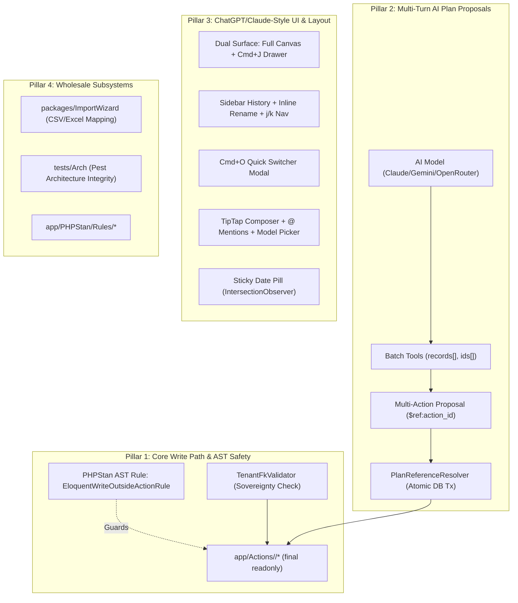

# ADR-032: Relaticle Architectural Patterns, ChatGPT/Claude-Style UI/UX Layout, and Wholesale Subsystem Adoption

- **Status**: Accepted
- **Date**: 2026-09-02
- **Author**: Antigravity Agent, System Architecture & DPIK Engineering
- **Context**: Deep technical review of https://github.com/relaticle/relaticle.git (an AI-native CRM platform built on Laravel 13, Filament 5, Livewire 4, and native MCP) to extract proven enterprise architectural patterns, conversational UI/UX conventions, and reusable subsystems for **DPIK Tadbir** (Executive Command Center & Email Intelligence Copilot).

---

## 1. Problem Statement & Motivation

While DPIK Tadbir successfully delivers core email intelligence, SQLite FTS5 hybrid search, and single-action approval cards, several architectural and user experience bottlenecks exist as complexity scales:

1. **Scattered Write Paths**: Database mutations risk being split across Livewire components, Filament pages, Controllers, and MCP tool handlers without a strictly enforced single-entry pipeline.
2. **Disconnected Multi-Step AI Writes**: When the AI extracts complex commitments (e.g. creating a project contact, then creating a linked follow-up task), it either executes in multiple separate conversational turns or requires custom procedural glue, increasing failure rates.
3. **Conversational Navigation Limitations**: The current Copilot drawer lacks first-class session management familiar to users of ChatGPT, Claude, and Gemini (e.g. quick conversation search `Cmd+O`, sidebar session history with inline rename, Vim-style `j`/`k` navigation, floating sticky date capsules, and `@` mention entity auto-complete).
4. **Data Onboarding Friction**: Senior management and partners frequently receive external project schedules, tender tracking spreadsheets, and contact sheets with no standardized CSV/Excel bulk-mapping and validation wizard.
5. **Prompt-Cache Churn**: Mutating previous message states during agent execution invalidates OpenRouter/Anthropic KV prompt caching, multiplying token costs and latency.

---

## 2. Decision & Architectural Blueprint

DPIK Tadbir adopts a structured 4-pillar integration strategy derived from Relaticle's battle-tested patterns:

---

## 3. Pillar Breakdown & Feature Specifications

### Pillar 1: Strict Action-Centric Write Discipline & AST Enforcement

* **Single Source of Truth**: All database writes (`create`, `update`, `delete`, `sync`, `attach`) must reside exclusively in `app/Actions/<Domain>/` classes structured as `final readonly class` with a single `execute()` method.
* **PHPStan AST Guard (`EloquentWriteOutsideActionRule`)**:
  - Automatically fails CI / static analysis if Eloquent write methods are invoked directly inside Controllers, Livewire components, Filament classes, or MCP tools.
* **Sovereign Tenant Validation (`TenantFkValidator`)**:
  - Verifies that all relational foreign keys passed in AI tool arguments (e.g. `project_id`, `partner_id`, `user_id`) strictly belong to the authenticated executive's sovereign workspace before executing writes.

### Pillar 2: Multi-Step Plan Chaining & Atomic Action Approvals

* **Reference Notation (`$ref:<pending_action_id>`)**:
  - Enables the AI Copilot to construct dependent write chains in **a single conversational turn** (e.g. Step 1: Create Tender Contact; Step 2: Create Action Item linked to `assigned_to = "$ref:1"`).
* **`PlanReferenceResolver` Engine**:
  - Resolves `$ref` placeholders inside a single database transaction upon executive approval.
  - Automatically rolls back all mutations if any step fails.
* **Immutable Tool History (Prompt Cache Preservation)**:
  - Preserves exact historical message payloads to maintain Anthropic and OpenRouter KV prompt-cache hits.
  - Passes state updates exclusively via dynamic `<resolved_actions>` and `<superseded_proposals>` tags.

### Pillar 3: ChatGPT / Claude / Gemini Conversational UI & Layout

* **Dual-Surface Synergy**:
  1. **Full-Page Canvas (`/admin/copilot`)**: A `calc(100dvh - 4rem)` distraction-free executive workspace with centered `max-w-3xl` reading column for deep research.
  2. **Contextual Slide-Over Drawer (`Cmd+J`)**: Instant slide-over drawer with ambient record attachment chips (`[ 🏢 JKR Sarawak ✖ ]`).
* **Session Management & History Navigation**:
  - **Sidebar Chat Accordion**: Integrates recent conversations directly into Filament's main sidebar with inline renaming (`@blur="save()"` / `Escape`), delete confirmation, and `n` (new chat), `j`/`k` (up/down session traversal) shortcuts.
  - **Quick Conversation Switcher (`Cmd+O`)**: Spotlight/Raycast-style fuzzy search modal across all historical chats.
* **Transcript & Message Experience**:
  - **Sticky Date Capsule**: Dynamic floating pill (`Today`, `Yesterday`, `August 28, 2026`) pinned at the top of the transcript via `IntersectionObserver`.
  - **Natural Language Tool Shimmers**: Real-time localized status badges (e.g. *"Searching email threads..."*, *"Synthesizing commitments..."*).
  - **Unified Typography**: Zero-layout-shift typography classes shared across live-streaming and persisted markdown.
* **Next-Generation Composer Dock**:
  - Auto-expanding rounded capsule with character counter threshold indicators (>4000 chars warning in amber/red).
  - **TipTap Rich Editor with `@` Mentions**: Autocomplete tagging for `@Projects`, `@Tenders`, and `@Partners`.
  - **In-Dock Model Switcher**: Fast model switcher dropdown (Claude 3.7 Sonnet, Gemini 2.5 Flash, Auto).
  - **Docked Action Proposal Cards**: Seamlessly transforms the composer into an interactive approval card with pinned decision buttons.

### Pillar 4: Wholesale Subsystems & DevTooling Integration

* **`ImportWizard` Package**:
  - 4-step wizard: **Upload** -> **Column Auto-Mapping** -> **Review & Match** -> **Queued Batch Execution** with downloadable failed row CSVs.
  - Tailored for ingesting JKR tender trackers, project registers, and client contact lists.
* **Pest Architecture Test Suite (`tests/Arch/`)**:
  - `ArchTest.php` enforcing module boundaries, no direct Eloquent writes outside Actions, and naming conventions.
  - `TestSuiteIntegrityTest.php` ensuring all test files are registered in CI suites.

---

## 4. Implementation & Rollout Roadmap

| Phase | Target Scope | Key Deliverables |
| :--- | :--- | :--- |
| **Phase 1: Quality Gates & AST Guard** | Static Analysis & Write Path | • Port `EloquentWriteOutsideActionRule.php` to `app/PHPStan/Rules/` • Register in `phpstan.neon` • Port Pest `tests/Arch/ArchTest.php` |
| **Phase 2: Multi-Turn Action Plans** | Core AI Engine | • Port `PlanReferenceResolver.php` and `ProposalPlanService.php` • Update Copilot Action Cards to support `$ref` chaining in single transactions |
| **Phase 3: Conversational UI Overhaul** | Frontend / Livewire | • Implement Full-Page Chat Page (`/admin/copilot`) • Implement Sidebar History with inline rename and `n`/`j`/`k` shortcuts • Implement `Cmd+O` Conversation Switcher • Add Floating Sticky Date Capsule & Shimmer Tool Badges |
| **Phase 4: Data Ingestion Wizard** | Subsystems | • Port `packages/ImportWizard` for bulk tender and contact onboarding |

---

## 5. Consequences & Trade-offs

### Positive
- **Rock-Solid Write Safety**: Eliminates untracked, un-scoped database mutations across all UI and AI interfaces.
- **Superior Executive UX**: Provides an intuitive, fluid chat experience matching top-tier commercial AI assistants.
- **Atomic Operations**: Eliminates partial or corrupted multi-step AI creations through transaction-wrapped reference resolution.
- **Drastic Reduction in Custom Code**: Adopts ~8,000 lines of refined, tested code (importers, arch linters, tip-tap mentions) instead of reinventing them.

### Negative & Mitigations
- **PHPStan Strictness**: Developers must create Action classes for any new write path. *Mitigation: Supported by standard templates and artisan generators.*
- **TipTap / Livewire Syncing**: Rich text editor lifecycle requires `wire:ignore` and carefully scoped Alpine event dispatches. *Mitigation: Use Relaticle's tested `chat-editor.js` integration verbatim.*

---

## 6. Verification & Acceptance Criteria

1. **AST Linter Verification**: Running `vendor/bin/phpstan analyse` flags any direct `Model::create()` or `->update()` call placed inside Livewire or MCP tools.
2. **Plan Reference Test**: Automated feature test verifying a 2-step proposal (`CreatePerson` -> `CreateTask` with `$ref:1`) executes atomically inside a single transaction and resolves the foreign key correctly.
3. **Keyboard Navigation Verification**: Pressing `Cmd+O` opens the search modal; pressing `n` creates a fresh conversation; pressing `j`/`k` moves through recent chats.
4. **Import Wizard Verification**: Uploading a sample JKR tender spreadsheet passes column inference, previews mapped rows, and executes bulk import via queued jobs.
