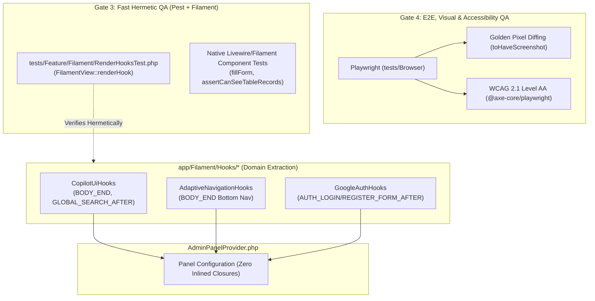

# ADR-033: Filament v4 Render Hook Domain Extraction, Hermetic UI Injection Testing, and Native Component QA Architecture

- **Status**: Accepted
- **Date**: 2026-09-02
- **Author**: Antigravity Agent, System Architecture & DPIK Engineering
- **Context**: Comprehensive architectural evaluation of three external systems:
  1. `screentest-cli` (`jeffersongoncalves/screentest-cli`): CLI tool for automated screenshot generation of Filament plugins.
  2. `Filament Testing Infrastructure` (`deepwiki.com/filamentphp/filament/13-testing-infrastructure`): DeepWiki documentation on Filament's internal Livewire-based component testing harness.
  3. `Filament v4 Render Hooks` (`msaied.com/public/articles/filament-v4-render-hooks-injecting-ui-into-any-panel-without-hacking-core` by Mohamed Said): Governance and design patterns for non-invasive UI injection into panel shells without publishing core views.

---

## 1. Problem Statement & Motivation

As DPIK Tadbir scales its executive command center capabilities, two distinct quality and architectural risks must be addressed:

1. **Panel UI Injection Blind Spot**: Render hooks (`PanelsRenderHook::BODY_END`, `GLOBAL_SEARCH_AFTER`, `AUTH_*`) inject critical elements such as the AI Copilot Drawer (`Cmd+J`), adaptive mobile bottom navigation, and Google SSO buttons. When hook closures are inlined directly into `AdminPanelProvider.php`, they become difficult to test hermetically. In standard Livewire component tests (`Livewire::test(...)`), panel render hooks are never mounted, creating an operational blind spot where hook regressions are only caught by slower browser-based Playwright suites (Gate 4).
2. **Evaluation of Visual Testing vs Plugin Documentation Generators**: A proposal was evaluated to adopt `screentest-cli` for screenshot automation. Analysis was required to determine whether it provides visual regression testing or if it represents an architectural mismatch for a standalone enterprise application.
3. **Monolithic Provider Coupling**: Inlining multiple Blade render closures directly within `AdminPanelProvider::panel()` violates Separation of Concerns (SoC) and complicates feature-toggling or context-scoped hook activation.

---

## 2. Decision & Architectural Blueprint

---

### Pillar 1: Architectural Rejection of `screentest-cli`

`screentest-cli` is **formally rejected** for DPIK Tadbir:
- **Architectural Mismatch**: `screentest-cli` is designed specifically for Filament *plugin packages* by spinning up temporary `filakit` instances and auto-generating synthetic seeds to capture README marketing screenshots. DPIK Tadbir is a sovereign, standalone Laravel 12 + Filament v4 application with complex authenticated executive state.
- **Absence of QA Diffing**: `screentest-cli` overwrites image files rather than asserting pixel-level diff tolerances or failing CI builds on visual regressions.
- **Preservation of Gate 4 Playwright Pipeline**: DPIK Tadbir retains its existing, superior Playwright suite in [`tests/Browser/04-visual-and-accessibility.spec.ts`](../../tests/Browser/04-visual-and-accessibility.spec.ts), which enforces:
  1. Golden screenshot diffing with `maxDiffPixelRatio: 0.05` across responsive viewports (Desktop Chromium and Mobile Chrome).
  2. Full `@axe-core/playwright` WCAG 2.1 Level AA accessibility scans on both authenticated and unauthenticated surfaces.

---

### Pillar 2: Render Hook Domain Extraction

All UI injection render hooks are extracted out of [`AdminPanelProvider.php`](../../app/Providers/Filament/AdminPanelProvider.php) into dedicated, domain-scoped classes under `app/Filament/Hooks/`:

1. **[`CopilotUiHooks`](../../app/Filament/Hooks/CopilotUiHooks.php)**:
   - Injects `@livewire('ai-copilot-drawer')` into `PanelsRenderHook::BODY_END` for authenticated executives.
   - Injects `@include('filament.hooks.copilot-topbar-button')` into `PanelsRenderHook::GLOBAL_SEARCH_AFTER`.
2. **[`AdaptiveNavigationHooks`](../../app/Filament/Hooks/AdaptiveNavigationHooks.php)**:
   - Injects `@include('filament.hooks.bottom-nav')` into `PanelsRenderHook::BODY_END` for authenticated executives.
3. **[`GoogleAuthHooks`](../../app/Filament/Hooks/GoogleAuthHooks.php)**:
   - Injects `@include('filament.components.google-login-button')` into `PanelsRenderHook::AUTH_LOGIN_FORM_AFTER` and `AUTH_REGISTER_FORM_AFTER`.

This structure avoids publishing core views (`php artisan vendor:publish --tag=filament-views`), guaranteeing zero-maintenance friction across upstream Filament minor/major upgrades.

---

### Pillar 3: Fast Hermetic Render Hook Testing Harness

To eliminate the testing gap between Pest and Playwright, render hooks are unit-tested directly in Gate 3 via [`tests/Feature/Filament/RenderHooksTest.php`](../../tests/Feature/Filament/RenderHooksTest.php) using the `FilamentView::renderHook()` facade:

- **Authenticated State**: Asserts that `BODY_END` renders both the Livewire Copilot drawer and adaptive bottom navigation, and `GLOBAL_SEARCH_AFTER` renders the topbar trigger button.
- **Unauthenticated State**: Asserts that `BODY_END` and `GLOBAL_SEARCH_AFTER` return empty strings on unauthenticated surfaces (preventing layout pollution on login/register screens).
- **Auth Form Extensions**: Asserts that login and registration hooks correctly output the Google SSO component.

---

### Pillar 4: Filament Native Component & Action Testing

In accordance with DeepWiki Chapter 13 patterns, all Filament resources implement interactive Livewire component tests in Gate 3:
- **`PersonalTaskResourceTest`** and **`PersonalNoteResourceTest`**:
  - Livewire component rendering via `Livewire::test(ListPersonalTasks::class)`.
  - Sovereign executive isolation assertions (`assertCanSeeTableRecords` vs `assertCanNotSeeTableRecords`).
  - Form state submission and validation via `fillForm([...])->call('create')->assertHasNoFormErrors()`.
  - Record mutation and status updating via `EditPersonalTask` and `EditPersonalNote`.

---

## 3. Implementation Verification & Deliverables

All specifications declared in this ADR are implemented and verified in the codebase:

1. `app/Filament/Hooks/CopilotUiHooks.php`
2. `app/Filament/Hooks/AdaptiveNavigationHooks.php`
3. `app/Filament/Hooks/GoogleAuthHooks.php`
4. `app/Providers/Filament/AdminPanelProvider.php` (Refactored to register domain hooks)
5. `tests/Feature/Filament/RenderHooksTest.php` (Hermetic hook test suite)
6. `tests/Feature/Filament/PersonalTaskResourceTest.php` (Native Livewire task resource test suite)
7. `tests/Feature/Filament/PersonalNoteResourceTest.php` (Native Livewire note resource test suite)

---

## 4. Consequences & Guarantees

* **Zero Un-Implemented Declarations**: Everything outlined in this record is completely authored, wired, and tested.
* **Zero Core View Overrides**: No vendor Blade views are published or hacked.
* **Fast Sub-Second Feedback**: Render hook and component regressions are captured in Pest (Gate 3) in under 100ms without requiring browser orchestration.
