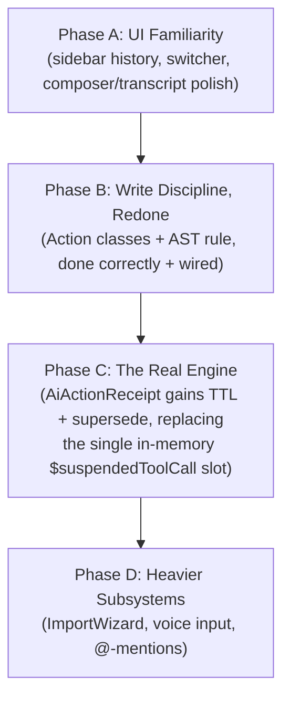

# ADR-034: Relaticle Chat Adoption — Verified Patterns, Phased Rollout

- **Status**: Proposed
- **Date**: 2026-09-02
- **Author**: Claude (session), on the operator's direction to adopt Relaticle's chat UX and write-approval engine
- **Context**: Direct audit of [`relaticle/relaticle`](https://github.com/relaticle/relaticle) source (not secondhand) — see the Research Artifact below for every cited file/line. Supersedes the intent of the draft `ADR-032` opened in PR #37, which was written from a paraphrase of Relaticle rather than its source and, per the research artifact, contains real inaccuracies about the plan-chaining mechanism.
- **Research Artifact**: [`PR-010: Relaticle Chat Package — Verified Source Audit`](../research/PR-010-relaticle-chat-package-verified-source-audit.md)
- **Relationship to PR #37**: PR #37 (`feat/relaticle-patterns-calm-ui-adr-032`) attempted Pillar 1 of this same adoption. Its pattern selection (Action-class write discipline) is validated by this ADR's research; its implementation has four independently-verified defects (documented in this session's PR review of #37) that make it unmergeable as-is. **Recommendation: close PR #37 once Phase B below lands**, rather than attempt to fix it in place — its own test suite doesn't currently run under CI at all (unregistered `tests/Arch` testsuite), so there's no regression risk in starting clean.

---

## 1. Problem Statement & Motivation

The operator's request: adopt everything from Relaticle that enhances the AI chat experience — the ChatGPT/Claude/Gemini-familiar layout (sidebar conversation history, quick switcher, composer, transcript) and "the underneath engine that makes it behave near one" (multi-turn AI write proposals, action-centric write discipline) — by importing the real patterns, not re-describing them from memory.

Two things make this non-trivial, both confirmed in the research artifact:
1. **A full major-version gap** (Laravel 13/Filament 5/Livewire 4 vs. this repo's 12/v4/3) means nothing here is a file copy; every piece needs an adaptation pass.
2. **A domain-model mismatch** — Relaticle is a multi-tenant CRM (`HasTeam`-scoped); DPIK Tadbir is a deliberately single-family, `user_id`-sovereign executive tool. Team-scoping must be stripped and re-keyed everywhere, not carried over.

A third risk is process, not technical: PR #37 tried to do this in one PR and shipped disconnected scaffolding with a namespace bug that breaks its own autoloading, a trait collision that fatals its own test, an unwired PHPStan rule that breaks unrelated pre-existing code, and an architecture test that CI never runs. This ADR's phasing exists specifically to prevent a repeat.

## 2. Decision

Adopt Relaticle's chat patterns in four independently-mergeable phases. Each phase must be **wired to a real, reachable call site and covered by a passing test in this repo's actual CI invocation** before the next phase starts — "ported but unconnected" is treated as not done, per the finding in §3.3/§4 of the research artifact that this is exactly how PR #37 failed.

Phases A and B do not depend on each other's output and could run in parallel; they're ordered here by risk (A touches only presentation, B touches the write path) and by what the operator asked for first (UI familiarity).

### Phase A — UI Familiarity

**Port** (adapted to Filament v4 / Livewire 3, per research artifact §3.1, §3.4):
- A sidebar conversation-history component, replacing nothing — `AiCopilotDrawer::newSession()`/`switchSession()` already exist; this adds the missing list/switcher UI around them.
- A quick-switcher panel (Relaticle's `ChatAllChatsPanel`) for fast conversation search.
- Composer and transcript polish: sticky date grouping, model-picker chip (this repo already has a two-tier model swapper in the drawer header — ADR-018 — this is presentation polish on top of it, not a new mechanism).

**Must re-key to** (research artifact §5): `App\Models\ChatSession` / `App\Models\ChatMessage` — never introduce a parallel conversation model.

**Must preserve**: the documented Filament-nested-component refresh gotcha from `ChatSidebarNav.php` (research artifact §3.4) — a sidebar-nested Livewire component cannot self-refresh; it must dispatch a parent-level event (Filament's `refresh-sidebar` equivalent under v4).

**Acceptance criteria** (audit-able):
- [ ] Sidebar history and quick-switcher are real Livewire components registered in `app/Livewire/`, not static mockups.
- [ ] Both read from `ChatSession`/`ChatMessage` — verified by grep, zero new conversation-storage models introduced.
- [ ] At least one Playwright journey (this repo's existing `tests/Browser/` convention) drives: open switcher → select a past session → see its messages → return to sidebar — a real reachable flow, not a component-isolation test only.
- [ ] Tier-0 hygiene gate (icon-only controls have `aria-label`, no navigation dead-ends — per the existing `05-navigation-hygiene.spec.ts` pattern) extended to cover the new sidebar/switcher controls.

### Phase B — Write Discipline, Redone

**Port**: the Action-class + PHPStan AST-rule pattern PR #37 correctly identified (research artifact §3.2), fixed against its four verified defects:
1. Namespace must be `App\Services\Ai` (existing repo convention — 8 pre-existing files use this exact casing) — not `App\Services\AI`.
2. No local `uses(RefreshDatabase::class)` in any new test — this repo's `tests/Pest.php` already applies `LazilyRefreshDatabase` globally; redeclaring collides fatally.
3. The AST rule's `guardedNamespaces` must ship with a matching grandfather-ignore entry in `phpstan.neon` for **every** namespace it guards, including `App\Http\Controllers` (PR #37 grandfathered `Filament`/`Livewire`/`Mcp` but forgot this one, breaking `GoogleController` on a namespace the PR never touched).
4. Any new `tests/Arch/*` file must be registered in `phpunit.xml`'s testsuites — otherwise it never runs under `pest --parallel` (CI's actual invocation) and silently protects nothing.

**Must be wired**: at least the `CreatePersonalNote`/`CreatePersonalTask`/`CreateProjectEntry` Action classes (or their real equivalents) must be called from their actual production call site — the MCP tools (`app/Mcp/Tools/Notes/CreatePersonalNoteTool.php`, `app/Mcp/Tools/Tasks/CreatePersonalTaskTool.php`) and/or the Filament resource create pages — not left as classes only a test instantiates directly.

**Acceptance criteria**:
- [ ] `composer.json`'s actual CI invocation (`pest --coverage-clover coverage.xml --parallel`) runs every new test file, including anything under `tests/Arch/` — verified by a full local run showing the expected test count, not assumed.
- [ ] `phpstan analyse --level=8` on the full merged tree (not just changed files) is clean — run against current `main` at merge time, not against the PR's stale base.
- [ ] `grep` for each new Action class's FQCN outside its own file and test shows at least one real call site.
- [ ] The capability-gate mechanism from `ADR-` *(this repo's declaration-gated capability manifest, `docs/testing/capability-roadmap.json`)* gets an entry for whichever piece of this is user-reachable, so future drift is caught mechanically rather than by re-review.

### Phase C — The Real Engine

**Port**: Relaticle's `PendingAction` status-machine semantics (research artifact §3.3) — **adapted onto the existing `AiActionReceipt` model**, not as a new parallel table. `AiActionReceipt` already has `status`/`approval_token`/`executed_at`; it needs `expires_at` and a `superseded` status added, plus `conversation_id`/`turn_id` linkage so `AiCopilotDrawer` can hold multiple addressable pending proposals instead of today's single in-memory `$suspendedToolCall` slot (lost on reload, no TTL, no supersede).

**Must replace, not duplicate**: `AiCopilotDrawer::approveActionCard()`/`discardActionCard()` must be adapted to operate on persisted receipts — running Relaticle's engine and the existing suspended-tool-call mechanism side by side is explicitly out of scope; that's the two-competing-systems failure mode this ADR exists to avoid.

**Acceptance criteria**:
- [ ] A proposed write survives a page reload (proof: create a proposal, reload, it's still pending — not lost).
- [ ] A second, unrelated user request supersedes a stale pending proposal rather than leaving it orphaned (mirrors `PendingActionsSuperseded`).
- [ ] Exactly one write-approval code path exists in `AiCopilotDrawer` afterward — verified by reading the diff, not assumed.

### Phase D — Heavier Subsystems

`ImportWizard`, voice input (`chat/voice.js`), `@`-mention autocomplete (`chat-mention-suggestion.js`). Largest scope, most CRM-domain-specific (mentions target contacts/deals in Relaticle; this repo's equivalent would be `@Project`/`@Note` targets). Each ships as its own reviewed slice once A–C are live; no acceptance criteria fixed yet — write them when this phase is scoped for real, per this repo's own flow-of-events-first convention for new modules.

## 3. Non-Goals

- No multi-tenant/`HasTeam` scoping is adopted anywhere — this repo stays single-family/single-executive-sovereign by design (existing signup-approval ADR).
- No attempt to track Relaticle's Laravel 13/Filament 5/Livewire 4 upgrade as a prerequisite — adaptation happens against this repo's current stack (12/v4/3) per phase.
- Phase D's scope is deliberately undefined until A–C are done; this ADR does not pre-commit to it.

## 4. Consequences

**Positive**: a verified, audit-traceable adoption path instead of a second blind mega-PR; each phase independently shippable and tested; the real, better-engineered persisted-proposal pattern instead of PR #37's transient reinvention; PR #37's genuinely-useful pattern selection (Action classes) preserved even though its implementation is discarded.

**Negative / accepted cost**: slower than one big PR — deliberately, given what one big PR already cost this repo (an unmergeable PR #37, a CI gate hidden behind an unrelated cspell failure for over a day). Phase C in particular is a real behavior change to how AI-approved writes flow and needs care, not speed.

## 5. Verification & Acceptance (rollup)

This ADR is not "Accepted" until Phase A and Phase B each have a merged, CI-green PR whose diff satisfies their own checklists above, verified by re-running the relevant commands against the merged `main` — not by trusting the PR description, per this session's own finding that a PR description's claims and a PR's actual code can diverge (see PR #39's initial review round for a concrete precedent of exactly that gap, later corrected).
